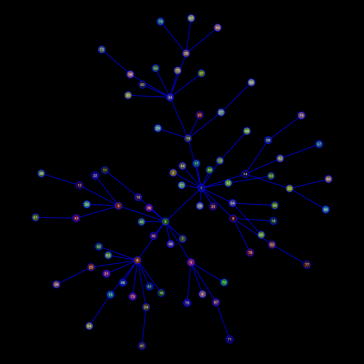

| **Documentation**                       | **Build Status**                          |
|:---------------------------------------:|:-----------------------------------------:|
| [![][docs-stable-img]][docs-stable-url] | [![Build Status][ci-img]][ci-url]         |
| [![][docs-development-img]][docs-development-url] |                                 |

Karnak.jl is a small extension for the Luxor.jl package to
help with visualizing graphs and networks.

Karnak also relies on
[Graphs.jl](https://github.com/JuliaGraphs/Graphs.jl) for
graph construction, and on
[NetworkLayout.jl](https://juliagraphs.org/NetworkLayout.jl/)
for graph layout.

## Quick start

```julia
using Karnak
using Graphs
using NetworkLayout
using Colors
g = barabasi_albert(100, 1)
@drawsvg begin
    background("black")
    sethue("grey40")
    fontsize(8)
    drawgraph(g, 
        layout=stress, 
        vertexlabels = 1:nv(g),
        vertexfillcolors = 
            [RGB(rand()/2, rand()/2, rand()/2) 
               for i in 1:nv(g)]
    )
end 600 400
```



## See also

There's a good selection of Julia packages for visualizing graphs:

- [TikzGraphs.jl](https://github.com/sisl/TikzGraphs.jl): backend: Tikz/Latex

- [GraphPlot.jl](https://juliagraphs.org/GraphPlot.jl/): backend: Compose.jl

- [SGtSNEpi.jl](https://github.com/fcdimitr/SGtSNEpi.jl): backend: Makie.jl

- [GraphRecipes.jl](https://github.com/JuliaPlots/GraphRecipes.jl): backend: Plots.jl

- [GraphMakie.jl](https://github.com/JuliaPlots/GraphMakie.jl): backend: Makie.jl


[docs-development-img]: https://img.shields.io/badge/docs-development-blue
[docs-development-url]: http://cormullion.github.io/Karnak.jl/dev/

[docs-stable-img]: https://img.shields.io/badge/docs-stable-blue.svg
[docs-stable-url]: http://cormullion.github.io/Karnak.jl/stable/

[ci-img]: https://github.com/cormullion/Karnak.jl/workflows/CI/badge.svg
[ci-url]: https://github.com/cormullion/Karnak.jl/actions?query=workflow%3ACI
