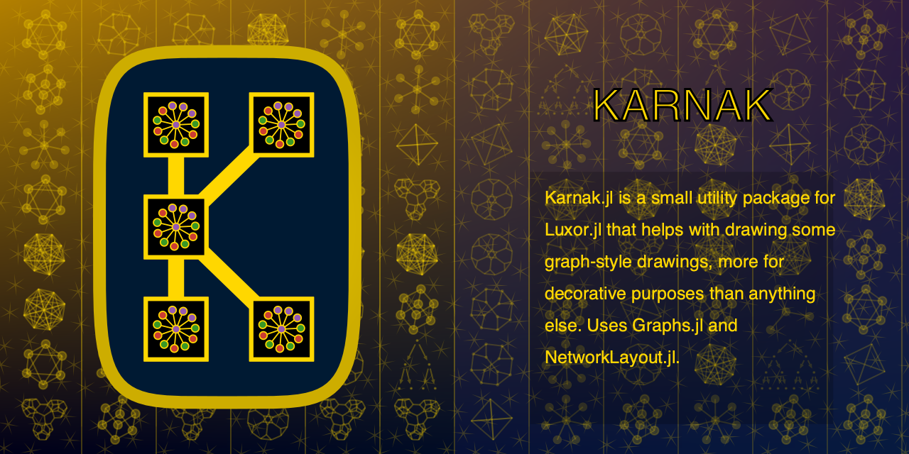

| **Documentation**                       | **Build Status**                          |
|:---------------------------------------:|:-----------------------------------------:|
| [![][docs-stable-img]][docs-stable-url] | [![Build Status][ci-img]][ci-url]         |
| [![][docs-development-img]][docs-development-url] |                                 |

Karnak.jl is a small extension for the Luxor.jl package to
help with constructing graph-style drawings.

Karnak relies on [Graphs.jl](https://juliagraphs.org/Graphs.jl/) for graph construction, and
on [NetworkLayout.jl](https://juliagraphs.org/NetworkLayout.jl/) for graph layout.

The focus in Karnak, unlike other graph visualization packages,
is on decorative and aesthetic uses, for use in design and generative art.

## Warning

For scientific and technical visualization, use one of
the following Julia packages:

- [TikzGraphs.jl](https://github.com/sisl/TikzGraphs.jl): backend: Tikz/Latex

- [GraphPlot.jl](https://juliagraphs.org/GraphPlot.jl/): backend: Compose.jl

- [SGtSNEpi.jl](https://github.com/fcdimitr/SGtSNEpi.jl): backend: Makie.jl

- [GraphRecipes.jl](https://github.com/JuliaPlots/GraphRecipes.jl): backend: Plots.jl

- [GraphMakie.jl](https://github.com/JuliaPlots/GraphMakie.jl): backend: Makie.jl

rather than this one.

[docs-development-img]: https://img.shields.io/badge/docs-development-blue
[docs-development-url]: http://github.com/cormullion/Karnak.jl/dev/

[docs-stable-img]: https://img.shields.io/badge/docs-stable-blue.svg
[docs-stable-url]: http://github.com/cormullion/Karnak.jl/stable/

[ci-img]: https://github.com/cormullion/Karnak.jl/workflows/CI/badge.svg
[ci-url]: https://github.com/cormullion/Karnak.jl/actions?query=workflow%3ACI
