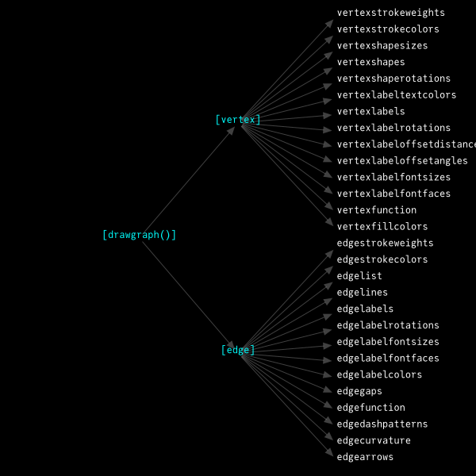

```@setup graphsection
using Karnak, Graphs, NetworkLayout, Colors, SimpleWeightedGraphs
```

# Syntax

## Overview

Karnak's function for drawing graphs is `drawgraph()`. This
takes a single argument, a `Graph`, and tries to place
representative graphics on the current Luxor drawing.

The default display for graphs is:

- current Luxor origin, scale and rotation

- current Luxor color for edges

- circles for all vertex shapes

- no vertex labels

- all edges drawn

```@example graphsection
@drawsvg begin
    background("grey10")
    sethue("darkcyan")
    g = complete_graph(10)
    drawgraph(g)
end 600 300
```

To control the appearance of the graph, you supply values to
the various keyword arguments. Apart from the general
keywords `BoundingBox`, `layout`, and `margin`, the keywords can
be grouped into two categories:



Most of these keyword arguments accept
vectors, ranges, and scalar values, and some accept
functions as well.

Here's a contrived (and consequently hideously ugly)
example of the type of syntax available:

```@example graphsection
@drawsvg begin
background("grey10")
sethue("purple")
g = smallgraph(:karate)
drawgraph(g, layout=stress,
    vertexshapes = [:square, :circle],
    vertexfillcolors = (v) -> v ∈ (1, 3, 6) ? colorant"red" : colorant"grey40",
    vertexstrokecolors = colorant"orange",
    vertexstrokeweights = range(0.5, 4, length=nv(g)),
    vertexshapesizes = 2 .* [Graphs.outdegree(g, v) for v in Graphs.vertices(g)],
    vertexlabelfontsizes = 2 .* [Graphs.outdegree(g, v) for v in Graphs.vertices(g)],
    vertexlabels = 1:nv(g),
    vertexlabelrotations = π/8,
    vertexlabeltextcolors = distinguishable_colors(10)
)
end 600 300
```

Here, the **outdegree** for each vertex (the number of edges
leaving it) is used to control the size of the vertices and
the font sizes too. `vertexshapes` flip-flops between
squares and circles for each vertex shape, but the size of
the shape is determined by a `vertexshapesizes` function,
which receives a Vector of sizes, the outdegree values for
each vertex. The font sizes of the labels are also set this
way. A `vertexfillcolors` function lets you determine the
shape's fill color for specific vertices, whereas the stroke
color is always orange, with stroke weights gradually
increasing. The colors of the labels are set by the
`Colors.distinguishable_colors()` function passed to
`vertexlabeltextcolors`. And all the labels are rotated, for
no particularly good reason.

Usually, if a vector runs out before the vertices and edges
have been drawn, some `mod1` magic means the values repeat
from the beginning again.

Use `drawgraph()` more than once, if needed, to build up the
graph in layers. Remember to use the same layout algorithm.

## Summary of keywords

|                            |                                                                                           |                                                                                                                                          |
| -------------------------: | :---------------------------------------------------------------------------------------- | :--------------------------------------------------------------------------------------------------------------------------------------- | 
| boundingbox                | BoundingBox                                                                               | drawing will fit inside this bounding box                                                                                                |
| margin                     | Number                                                                                    | margin in points/pixels                                                                                                                  |
| layout                     | Vector{Point}                                                                             | list of coordinates of each vertex                                                                                                       |
|                            | function from NetworkLayout.jl                                                            | squaregrid, shell, stress, etc                                                                                                           |
|                            | f(g::Graph)                                                                               | (g) -> spectral(adjacency_matrix(g), dim=2)                                                                                              |
| edgefunction               | f(edgenumber::Int, edgesrc::Int, edgedest::Int, from::Point, to::Point)                   | function that completely specifies the appearance of every edge. If present, none of the other edge- keyword arguments are used.         |
| vertexfunction             | f(vtx::Int, coordinates::Vector{Point})                                                   | function that completely specifies the appearance of every vertex. If present, None of the other vertex- keyword arguments will be used. |
| edgecurvature              | Float64                                                                                   | curviness of edge arrows                                                                                                                 |
| edgedashpatterns           | Vector{Vector}[number]                                                                    | vector of dash patterns                                                                                                                  |
|                            | Vector{Number}                                                                            | a dash pattern                                                                                                                           |
| edgegaps                   | Vector                                                                                    | gaps from each vertex center to arrow tip                                                                                                |
|                            | Range                                                                                     |                                                                                                                                          |
|                            | Real                                                                                      | gaps from every vertex center to arrow tip                                                                                               |
|                            | f(edgenumber, edgesrc, edgedest, from::Point, to::Point)                                                                                     | gaps from every vertex center to arrow tip                                                                                               |
| edgelabelcolors            | Vector{Colorant}                                                                          | colors of each vertex's label text                                                                                                       |
|                            | Colorant                                                                                  | color of all vertex labels                                                                                                               |
| edgelabelfontfaces         | Vector{Strings}[edgenumber]                                                               | font face for each edge                                                                                                                  |
|                            | String                                                                                    | font face for every edge                                                                                                                 |
|                            | :none                                                                                     |                                                                                                                                          |
| edgelabelfontsizes         | Vector{Number}                                                                            | the font size of each edge label                                                                                                         |
|                            | Number                                                                                    | the font size of every edge label                                                                                                        |
| edgelabelrotations         | Vector{angles}                                                                            | rotation of each label                                                                                                                   |
|                            | angle::Float64                                                                            | rotation of every label                                                                                                                  |
|                            | f(edgenumber, edges, edgedest, from, to)                                                  | function returns angle for this edge                                                                                                     |
| edgelabels                 | Vector                                                                                    |                                                                                                                                          |
|                            | range                                                                                     |                                                                                                                                          |
|                            | Dict{Int, Int}                                                                            | (src, dst) => "labeltext"                                                                                                                |
|                            | f(edgenumber, edgesrc, edgedest, from::Point, to::Point)                                  |                                                                                                                                          |
|                            | :none                                                                                     |                                                                                                                                          |
| edgelines                  | Vector{Int}                                                                               | numbers of edges to be drawn                                                                                                             |
|                            | range                                                                                     |                                                                                                                                          |
|                            | Int                                                                                       |                                                                                                                                          |
|                            | f(edgenumber, edgesrc, edgedest, from::Point, to::Point)                                  |                                                                                                                                          |
| edgelist                   | Graphs.EdgeIterator                                                                       | the edges to be drawn - takes prioity over edgelines                                                                                     |
| edgestrokecolors           | Vector{Colorant}[edge::Int]                                                               | colors for edges                                                                                                                         |
|                            | Colorant                                                                                  | color for every edge                                                                                                                     |
|                            | f(edgenumber, edgesrc, edgedest, from::Point, to::Point)                                  | function to set color for this edge                                                                                                      |
| edgestrokeweights          | Vector{Number}[vtx]                                                                       |                                                                                                                                          |
|                            | range                                                                                     |                                                                                                                                          |
|                            | Real                                                                                      |                                                                                                                                          |
|                            | f(edgenumber, edgesrc, edgedest, from::Point, to::Point)                                  | function that returns a value for line width                                                                                             |
| vertexfillcolors           | Vector{Colorant}                                                                          |                                                                                                                                          |
|                            | Colorant                                                                                  |                                                                                                                                          |
|                            | :none                                                                                     |                                                                                                                                          |
|                            | f(vtx::Int)                                                                               |                                                                                                                                          |
| vertexlabelfontfaces       | Vector{Strings}                                                                           | font face for each vertex                                                                                                                |
|                            | String                                                                                    | font face for every vertex                                                                                                               |
| vertexlabelfontsizes       | Vector                                                                                    |                                                                                                                                          |
|                            | range                                                                                     |                                                                                                                                          |
|                            | Real                                                                                      |                                                                                                                                          |
|                            | :none                                                                                     |                                                                                                                                          |
|                            | f(vtx::Int, coords::Point[])                                                              | function returns the fontsize for this label                                                                                             |
| vertexlabeloffsetangles    | Vector                                                                                    |                                                                                                                                          |
|                            | Range                                                                                     |                                                                                                                                          |
|                            | Real                                                                                      |                                                                                                                                          |
| vertexlabeloffsetdistances | Vector                                                                                    |                                                                                                                                          |
|                            | range                                                                                     |                                                                                                                                          |
|                            | Real                                                                                      |                                                                                                                                          |
| vertexlabelrotations       | Vector                                                                                    |                                                                                                                                          |
|                            | range                                                                                     |                                                                                                                                          |
|                            | Real                                                                                      |                                                                                                                                          |
|                            | :none                                                                                     |                                                                                                                                          |
| vertexlabels               | Vector{String}                                                                            | cycles                                                                                                                                   |
|                            | String                                                                                    | used for all vertices                                                                                                                    |
|                            | range[vtx::Int]                                                                           | string of the number in the range, cycles                                                                                                |
|                            | :none                                                                                     |                                                                                                                                          |
|                            | f(vtx::Int)                                                                               | function returns a string for the vertex label                                                                                           |
| vertexlabeltextcolors      | Vector{Colorant}                                                                          | color for each text label                                                                                                                |
|                            | Colorant                                                                                  | color of all text labels                                                                                                                 |
|                            | :none                                                                                     |                                                                                                                                          |
|                            | f(vtx::Int)                                                                               | function returning a colorant                                                                                                            |
| vertexshaperotations       | f(vtx::Int)                                                                               |                                                                                                                                          |
|                            | angle::Float64                                                                            |                                                                                                                                          |
| vertexshapes               | Vector of :circle :square :none                                                           | shapes of each vertex                                                                                                                    |
|                            | range[vtx]                                                                                | draw default shape at this vertex                                                                                                        |
|                            | :circle :square :none                                                                     | shape of every vertex                                                                                                                    |
|                            | f(vtx::Int)                                                                               | function draws shape at this vertex (which is Point(0, 0))                                                                               |
| vertexshapesizes           | Vector{Real}                                                                              |                                                                                                                                          |
|                            | range                                                                                     |                                                                                                                                          |
|                            | Real                                                                                      |                                                                                                                                          |
|                            | :none                                                                                     |                                                                                                                                          |
|                            | f(vtx::Int)                                                                               |                                                                                                                                          |
| vertexstrokecolors         | Vector                                                                                    |                                                                                                                                          |
|                            | Colorant                                                                                  |                                                                                                                                          |
|                            | :none                                                                                     |                                                                                                                                          |
|                            | f(vtx::Int)                                                                               |                                                                                                                                          |
| vertexstrokeweights        | Vector                                                                                    |                                                                                                                                          |
|                            | range                                                                                     |                                                                                                                                          |
|                            | :none                                                                                     |                                                                                                                                          |

## The BoundingBox

The graphics for the graph are placed to fit inside the
current BoundingBox (by default, the drawing), after
allowing for the margin (the default is 30). Pass a
different BoundingBox to the `boundingbox` keyword argument
to control the graph layout's size.

## Layout algorithms

The only clever part of this package is provided by
[NetworkLayout.jl](https://juliagraphs.org/NetworkLayout.jl/)),
which is where you should look for information about the
various algorithms that determine where vertices are
positioned.

You can choose a layout algorithm, or supply the vertex positions yourself.

The main layout algorithms available are:

- shell

- spring

- stress

- squaregrid

Here are some formulations which work as keywords in `drawgraph()`:

```julia
layout = squaregrid

layout = shell

layout = stress

layout = spectral

layout = (g) -> spectral(adjacency_matrix(g), dim=2)

layout = shell ∘ adjacency_matrix

layout = (g) -> sfdp(g, Ptype=Float64, dim=2, tol=0.05, C=0.4, K=2)

layout = Shell(nlist=[6:10,])

layout = Stress(iterations = 100, weights = M) # M is matrix of weights

layout = Spring(iterations = 200, initialtemp = 2.5)
```

Alternatively, you can pass a vector of points to the
`layout` keyword argument. Vertices will be placed on these
points (vertex 1 on point 1, etc...), rather than at points
suggested by the NetworkLayout algorithms. For example, in
this next drawing, the two sets of points for a bipartite
graph are generated beforehand.

```@example graphsection
@drawsvg begin
background("grey10")
N = 12; H = 250; W = 550
g = complete_bipartite_graph(N, N)
pts = vcat(
    between.(O + (-W/2, -H/2),  O + (-W/2, H/2),  range(0, 1, length=N)), # left set
    between.(O + (W/2, H/2),   O + (W/2, -H/2), range(0, 1, length=N)))   # right set
circle.(pts, 1, :fill)
drawgraph(g, vertexlabels = 1:nv(g), layout = pts,
    edgestrokeweights = 0.5,
    edgestrokecolors = (n, f, t, s, d) -> HSB(rescale(n, 1, ne(g), 0, 360), 0.6, 0.9))
end 600 300
```

The calculated positions are returned by the `drawgraph()` function.

### Initial positions for the layout algorithms

Some of the layout algorithms - the Spring and Stress ones, for example -  allow you to pass _initial_ vertex positions to be used by the algorithms as starting points. The algorithm will continually adjust them to make a better result. These initial positions should be supplied as xy pairs, rather than Points (which NetworkLayout doesn't know about).

Here's an animation showing how the Stress algorithm gradually improves the layout on each iteration. The initial positions are just the "grid locations" of a Tiler iterator.

```julia
using Karnak, Graphs, NetworkLayout, Colors

function frame(scene, framenumber, G)

    background("black")
    initialpositions = [(pt.x, pt.y) for (pt, n) in Tiler(600, 600, 3, 3)]

    sethue("grey50")
    circle.(Point.(initialpositions), 3, :fill)

    for i in 1:framenumber
        setopacity(rescale(i, 1, scene.framerange.stop, 0, 0.6))
        drawgraph(G,
            layout=Stress(initialpos=initialpositions, iterations=i),
            vertexfillcolors=(i == framenumber) ? colorant"gold" : :none
        )
    end

end

function main()
    G = smallgraph(:petersen)
    amovie = Movie(600, 600, "layout")
    animate(amovie,
        Scene(amovie, (s, f) -> frame(s, f, G), 1:60),
        framerate=10, creategif=true)
end

main()
```


## The `vertexfunction` and `edgefunction` arguments

The two keyword arguments `vertexfunction` and `edgefunction` allow you to pass control over the drawing process completely to these two functions.

!!! note

    If you define these functions, all the other vertex/edge keywords are ignored.

```
vertexfunction = my_vertexfunction(vertex, coordinates)
edgefunction = my_edgefunction(edgenumber, edgesrc, edgedest, from::Point, to::Point)
```

These allow you to place graphics at `coordinates[vertex]`, and to draw edges from `from` to `to`, using any available tools for drawing.

In the following picture, the vertex positions were passed to a function that placed clipped PNG images on the drawing (using `readpng()` and `placeimage()`), and the edges were drawn using sine curves. Refer to the Luxor.jl documentation for more about putting colored things on drawings.


It's also possible, for example, to draw a graph at a vertex point (ie recursive graph drawing) if you use `vertexfunction`.

```@example graphsection
g = complete_graph(5)

function rgraph(g, l=1)
    if l > 4
        return
    else
        drawgraph(g,
            layout=stress,
            boundingbox=BoundingBox() / 2l,
            vertexfunction=(v, c) -> begin
                @layer begin
                    sethue(HSB(rescale(v, 1, 4, 0, 360), 0.7, 0.8))
                    translate(c[v])
                    #circle(c[v], 5, :fill)
                    rgraph(g, l + 1)
                end
            end,
            )
    end
end

@drawsvg begin
    background("grey10")
    sethue("gold")
    rgraph(g)
end 800 600
```

## Functions as keyword arguments

The following keyword arguments accept functions:

- `edgelabelrotations`
- `edgelabels`
- `edgelines`
- `edgestrokecolors`
- `edgestrokeweights`
- `vertexfillcolors`
- `vertexlabels`
- `vertexlabeltextcolors`
- `vertexshaperotations`
- `vertexshapes`
- `vertexshapesizes`
- `vertexstrokecolors`
- `vertexstrokeweights`

The `edge-` keywords accept functions with arguments `(edgenumber, sourcevertex, destinationvertex, frompoint, topoint)`.
The `vertex-` keywords accept functions with arguments `(vertex)`.

These functions aren't used if you supply functions to `vertexfunction` or `edgefunction`.

## Vertex labels and shapes

### `vertexlabels`

Use `vertexlabels` to choose the text to associate with each vertex. Supply a range, array of strings or numbers, a single string, or a function.

This example draws all vertices, and numbers them from 1 to 6.

!!! note

    In Graphs.jl, vertices are always numbered from 1 to `n`. If you remove a vertex, vertices are effectively re-numbered.

```@example graphsection
@drawsvg begin
    background("grey10")
    g = smallgraph(:octahedral)
    sethue("gold")
    drawgraph(g, layout=stress,
        vertexlabels = 1:nv(g),
        vertexshapesizes = 10)
end 600 300
```

A function can be passed to `vertexlabels` to display a
vertex; it should accept a single numerical argument, the
vertex number, and return a string to display. Labelling all
of them isn't always necessary.

```@example graphsection
@drawsvg begin
background("grey10")
g = smallgraph(:octahedral)
sethue("skyblue")
drawgraph(g, layout=stress,
    vertexlabels = (v) -> v ∈ (1, 4, 6) && string(v, "/6"),
    vertexshapesizes = 15,
    vertexlabelfontsizes = 20,
    )
end 600 300
```

### Using LaTex in labels

If you want to use ``\LaTeX`` in vertex labels, you can load
[MathTeXEngine.jl](https://github.com/Kolaru/MathTeXEngine.jl) to parse the
`LaTeXString`s. Make sure the fonts in the MathTexEngine package
are also available to the Operating System's font routines (so __copying__ them
to your local font folder is probably required).

```julia
using Karnak, Graphs, NetworkLayout, Colors
using MathTeXEngine, LaTeXStrings

g = complete_graph(4)
@svg begin
    background("grey10")
    sethue("cyan")
    fontsize(40)
    drawgraph(g,
        margin=30,
        vertexlabels = [L"v_%$(x)" for x in 1:nv(g)],
        vertexlabeloffsetdistances = [40, 40, -40, 40],
        vertexlabeltextcolors = colorant"white"
    )
end 600 300
```


### `vertexshapes` and `vertexshapesizes`

The default shape for a vertex is a filled circle.

Options for `vertexshapes` are `:circle` and `:square`. With just two in a vector, they will be used alternately.

```@example graphsection
@drawsvg begin
background("grey10")
g = smallgraph(:moebiuskantor)
sethue("gold")
drawgraph(g, layout=shell, vertexshapes = [:square, :circle])
end 600 300
```

`vertexshapesizes` can set the sizes for the built-in vertex shapes.

```@example graphsection
@drawsvg begin
background("grey10")
g = smallgraph(:moebiuskantor)
sethue("gold")
drawgraph(g, layout=shell,
    vertexshapes = [:square, :circle],
    vertexshapesizes = [15, 5])
end 600 300
```

```@example graphsection
@drawsvg begin
background("grey10")
g = smallgraph(:moebiuskantor)
sethue("gold")
drawgraph(g, layout=shell,
    vertexshapesizes = (v) -> rescale(v, 1, nv(g), 5, 25))
end 600 300
```

`vertexshaperotations` can set the rotations.

```@example graphsection
@drawsvg begin
background("grey10")
g = smallgraph(:moebiuskantor)
sethue("gold")
drawgraph(g, layout=shell,
    vertexshapes = :square,
    vertexshapesizes = [10, 20, 5],
    vertexshaperotations = [π/2, π/3],
    )
end 600 300
```

To show every other vertex and label, you could use something like this:

```@example graphsection
@drawsvg begin
background("grey10")
g = smallgraph(:truncatedcube)
sethue("darkturquoise")
drawgraph(g, layout=stress,
    vertexlabels = ["1", ""],
    vertexshapesizes = [10, 0])
end 600 300
```

When circles and squares don't cut it, supply a function to `vertexshapes`. The single argument is the vertex number; any graphics you draw will be centered at the vertex location, the current origin, `Point(0, 0)`.

```@example graphsection
@drawsvg begin
background("grey10")
g = smallgraph(:moebiuskantor)
sethue("hotpink")
drawgraph(g, layout=shell,
    vertexshapes = (v) -> star(O, 15, v+2, 0.5, 0, :fill))
end 600 300
```

Here, the vertex number is hinted at by the number of points on each star.

In the next example, the sizes of the labels and shapes are determined by the degree of each vertex, supplied in a vector.

```@example graphsection
@drawsvg begin
background("grey10")
g = smallgraph(:karate)
sethue("slateblue")
drawgraph(g, layout=stress,
    vertexlabels = 1:nv(g),
    vertexlabelfontsizes = [Graphs.outdegree(g, v) for v in Graphs.vertices(g)],
    vertexshapesizes = [Graphs.outdegree(g, v) for v in Graphs.vertices(g)],
    vertexfillcolors = (v) -> v ∈ (1, 3, 6) && colorant"red",
    )
end 600 300
```

One more example with `vertexshapes`.

```@example graphsection
function whiten(col::Color, f=0.5)
    hsl = convert(HSL, col)
    h, s, l = hsl.h, hsl.s, hsl.l
    return convert(RGB, HSL(h, s, f))
end

function drawball(pos, ballradius, col::Color;
        fromlum=0.2,
        tolum=1.0)
    gsave()
    translate(pos)
    for i in ballradius:-0.25:1
        sethue(whiten(col, rescale(i, ballradius, 0.5, fromlum, tolum)))
        offset = rescale(i, ballradius, 0.5, 0, -ballradius/2)
        circle(O + (offset, offset), i, :fill)
    end
    grestore()
end

@drawsvg begin
background("grey10")
g = clique_graph(5, 6)
sethue("yellow")
setline(0.2)
drawgraph(g,
    layout = stress,
    vertexshapes = (v) -> drawball(O, 25, RGB([Karnak.Luxor.julia_red,Karnak.Luxor.julia_purple, Karnak.Luxor.julia_green][rand(1:end)]...))
)
end 600 600
```

### `vertexstrokecolors` and `vertexfillcolors`

These keywords accept a Colors.jl `colorant`, an array of them, or a function that generates a color.

```@example graphsection
@drawsvg begin
background("grey10")
g = smallgraph(:cubical)
sethue("darkorange")
drawgraph(g, layout=stress,
    vertexshapes = :square,
    vertexshapesizes =  20,
    vertexfillcolors = [colorant"red", colorant"blue"],
    vertexstrokecolors = [colorant"blue", colorant"red"])
end 600 300
```

The function should return a Colorant for a vertex:

```@example graphsection
@drawsvg begin
background("grey10")
g = smallgraph(:icosahedral)
sethue("darkorange")
drawgraph(g, layout=spring,
    vertexshapes = :circle,
    vertexshapesizes =  20,
    vertexstrokeweights = 5,
    vertexstrokecolors = (v) -> HSB(rescale(v, 1, nv(g), 360, 0), 1, 1),
    vertexfillcolors = (v)   -> HSB(rescale(v, 1, nv(g), 0, 359), 1, 1),
    )
end 600 300
```

or an array of colors:

```@example graphsection
@drawsvg begin
background("grey10")
sethue("orange")
g = grid((15, 15))
drawgraph(g,
    layout = squaregrid,
    vertexshapesizes = 15,
    vertexfillcolors = [RGB([Karnak.Luxor.julia_red, Luxor.julia_green,
        Luxor.julia_purple][rand(1:end)]...) for i in 1:nv(g)])
end 600 600
```

The following keyword arguments operate in a similar way:

- `vertexstrokeweights` : Array | Range | :none

- `vertexlabeltextcolors` : Array | Range | colorant

- `vertexlabelfontsizes` : Array | Range | number

- `vertexlabelfontfaces` : Array  | string

- `vertexlabelrotations` : Array | Range | number

- `vertexlabeloffsetangles` : Array | Range | number

- `vertexlabeloffsetdistances` : Array | Range | number

It's possible to specify the font faces for vertex labels, but it's difficult to demonstrate when the documentation is built on machines in the cloud with unknown typographical resources. But anyway:

```@example graphsection
@drawsvg begin
background("grey10")
g = smallgraph(:pappus)
sethue("slateblue")
drawgraph(g,
    vertexlabels = 1:nv(g),
    vertexshapes = 0,
    vertexlabelfontfaces = ["Times-Roman", "Courier", "Helvetica-Bold"],
    vertexlabelfontsizes = 30)
end 600 300
```

## Edge options

### `edgefunction`

As with `vertexfunction`, the `edgefunction` keyword argument allows you to do anything you like when the edges are drawn, and overrides all other `edge-` keyword arguments. Here, the calculated coordinates of the graph and a path between two vertices aren't drawn at first, just extracted into vectors for further processing.

```@example graphsection
@drawsvg begin
background("black")
sethue("white")
g = clique_graph(16, 4)

A = Point[]
B = Point[]

drawgraph(g, layout=stress,
    edgefunction = (edgenumber, edgesrc, edgedest, from, to) -> begin
        push!(A, from),
        push!(A, to)
        end,
    vertexshapes = :none,
    )

route = a_star(g, 6, 29)

drawgraph(g, layout=stress,
    edgelist = route,
    vertexshapes = :none,
    edgefunction = (edgenumber, edgesrc, edgedest, from, to) -> begin
        push!(B, from),
        push!(B, to)
        end)

setlinejoin("bevel")
setline(0.25)

sethue("grey60")
@layer begin
    poly(A, :stroke)
end

sethue("gold")
setline(4)
@layer begin
    poly(B, :stroke)
end
circle.(B[[begin, end]], 5, :fill)
end 600 400
```

!!! note

    This keyword overrides the other `edge-` keywords.

### `edgelist` and `edgelines`

A `Graphs.EdgeIterator` supplied to `edgelist` makes only the specified edges available for drawing. Otherwise, control which edges are to be drawn by supplying numbers (or a function) to `edgelines`.

```@example graphsection
@drawsvg begin
background("grey10")
sethue("orange")
g = grid((15, 15))
drawgraph(g,
    layout = stress,
    vertexshapes = :none,
    edgelines = rand(1:ne(g), 30)
)
end 600 300
```

`edgelist` is useful for drawing paths - a sequence of edges. For example, if you use `a_star()` to find the shortest path between two vertices, you can draw the edges with this keyword. It's useful to draw the graph twice, once with all edges, once with selected edges.

```@example graphsection
@drawsvg begin
background("grey10")
g = grid((15, 15))

astar = a_star(g, 1, nv(g))

sethue("orange")
drawgraph(g,
    layout = stress,
    vertexshapes = :none)

sethue("cyan")
drawgraph(g,
    layout = stress,
    vertexshapes = :none,
    edgestrokeweights = 5,
    edgelist = astar)
end 600 300
```

For more interesting arrows for edges, you can use arrows, and you can also define functions to create all kinds of graphical deatil:

```@example graphsection
gd = DiGraph() 
add_vertices!(gd, 4) 
add_edge!(gd, 1, 2) 
add_edge!(gd, 1, 3) 
add_edge!(gd, 2, 3) 
add_edge!(gd, 1, 4) # vertex 1 to vertex 4 
add_edge!(gd, 4, 1) # vertex 4 to vertex 1 

@drawsvg begin 
    background("grey10") 
    sethue("thistle1") 
    drawgraph(gd, vertexlabels = [1, 2, 3, 4],  
        edgefunction = (n, s, d, f, t) -> begin 
            arrow(f, t, [10, 10],  
            decoration = 0.75, 
            decorate = () -> begin 
                sethue(HSB(60n, 0.7, 0.8)) 
                ngon(O, 10, 3, 0, :fill)  
            end, 
            arrowheadfunction= (f, t, a) -> () 
            )    
        end 
    ) 
end 600 300 
```

```@example graphsection
@drawsvg begin
background("grey10")
g = star_graph(12)
fontsize(20)
sethue("slateblue")
drawgraph(g,
    layout=spring,
    vertexshapes = 0,
    vertexlabels = 1:nv(g),
    vertexlabelfontsizes = 12,
    edgestrokecolors = distinguishable_colors(ne(g)),
    edgelines = (k, s, d, f, t) ->
        arrow(f, between(f, t, .95), [20, -45],
            linewidth = 5,
            arrowheadlength = 15,
            arrowheadangle = π/7,
            decorate = () -> begin
                    sethue("purple")
                    circle(O, 15, :fill)
                    sethue("white")
                    text(string(k), angle = -getrotation(), halign = :center, valign=:middle)
                end,
            decoration = .7))
end 600 400
```

### Edge labels

Use `edgelabels`, `edgelabelcolors`, `edgelabelrotations`, etc. to control the appearance of the labels alongside edges.

```@example graphsection
@drawsvg begin
background("grey10")
g = smallgraph(:dodecahedral)
g = complete_graph(5)
sethue("orange")
fontsize(20)
drawgraph(g, layout=stress,
    vertexshapes = :none,
    vertexlabels = "vertex",
    vertexlabeltextcolors = colorant"cyan",
    edgelabels = ["edge"],
    edgestrokecolors = colorant"orange",
    edgelabelcolors = colorant"pink",
    )
end 600 500
```

`edgelabels` can also be a dictionary, where the keys are tuples: `(src, dst)`, and the values are the text labels.

```@example graphsection
g = complete_graph(5)
edgelabeldict = Dict()
n = nv(g)
for i in 1:n
    for j in 1:n
        edgelabeldict[(i, j)] = "($i, $j)"
    end
end

@drawsvg begin
    background("grey10")
    drawgraph(g, layout=stress,
        vertexshapes = :circle,
        vertexlabels = 1:n,
        edgestrokecolors = colorant"orange",
        edgelabelcolors = colorant"white",
        edgelabels = edgelabeldict)
end 600 350
```

The `edgelabels` keyword argument can also accept a function with five arguments: `edgenumber`, `source`, `destination`, `from` and `to`. In this example, the graphical distances between the two vertex positions provide the annotations for each edge.

```@example graphsection
@drawsvg begin
background("grey10")
g = smallgraph(:dodecahedral)
g = complete_graph(5)
fontsize(20)
drawgraph(g, layout=stress,
    vertexshapes = :none,
    edgestrokecolors = colorant"orange",
    edgelabels = (k, src, dest, f, t) -> begin
        @layer begin
            sethue("white")
            θ = slope(f, t)
            text(string(round(distance(f, t), digits=1)),
                midpoint(f, t),
                angle=θ,
                halign=:center)
        end
    end)
end 600 500
```

The more code you're prepared to write, the more elaborate your labels can be:

```@example graphsection
sources      = [1,2,1]
destinations = [2,3,3]
weights      = [0.5, 0.8, 2.0]
g = SimpleWeightedGraph(sources, destinations, weights)
@drawsvg begin
background("grey10")
sethue("gold")
drawgraph(g,
    vertexlabels = 1:nv(g),
    vertexshapesizes = 20,
    vertexlabelfontsizes = 30,
    edgecurvature = 10,
    edgegaps = 25,
    edgelabels = (edgenumber, edgesrc, edgedest, from, to) -> begin
        @layer begin
            sethue("black")
            box(midpoint(from, to), 50, 30, :fill)
        end
        box(midpoint(from, to), 50, 30, :stroke)
        fontsize(16)
        text(string(get_weight(g, edgesrc, edgedest)),
            midpoint(from, to),
            halign=:center,
            valign=:middle)
    end)
end 600 300
```

For directed weighted graphs, each edge can have two weights. This makes it slightly more difficult to draw the labels automatically. You could write an edge labelling function that calculates the slope of the edge and positions the label accordingly:

```julia
function f(edgenumber, edgesrc, edgedest, from::Point, to::Point)
    sl = slope(from, to)
    wt = g.weights[edgesrc, edgedest]
    if sl > π
        label(string(wt), :e, midpoint(from, to))
    else
        label(string(wt), :w, midpoint(from, to))
    end
end 

...
    edgelabels=f,
...
```

### `edgelist`

This example draws the graph more than once; once with all the edges, once with only the edges in `edgelist`, where `edgelist` is the path from vertex 15 to vertex 17, drawn in a pale translucent yellow, and once to draw the vertices on the path "X marks the spot" cyan-colored crosses.

```@example graphsection
@drawsvg begin
    background("grey10")
    g = smallgraph(:karate)
    sethue("slateblue")

    drawgraph(g, layout = stress,
        vertexlabels = 1:nv(g),
        vertexshapes = :circle,
        vertexshapesizes = 10,
        vertexlabelfontsizes = 10)

    astar = a_star(g, 15, 17)

    drawgraph(g,
        layout=stress,
        vertexshapes = :none,
        edgelist = astar,
        edgestrokecolors=RGBA(1, 1, 0, 0.5),
        edgestrokeweights=10)

    drawgraph(g,
        layout=stress,
        edgelines=0,
        vertexshapes = (v) -> v ∈ src.(astar) && polycross(O, 20, 4, 0.5, π/4, :fill),
             vertexfillcolors = (v) -> v ∈ src.(astar) && colorant"cyan"
        )
end 600 600
```

### `edgecurvature` and `edgegaps`

The `edgecurvature` keyword determines the curvature of the edges. 

The `edgegaps` keyword sets the distances between the ends of the edges and the vertex positions. 

Units, as everywhere in Karnak, are points/pixels (1 point is 0.3527mm).

```@example graphsection
g = grid((3, 3))

# add some self-loops
for e in edges(g)
    add_edge!(g, src(e), src(e))
    add_edge!(g, dst(e), dst(e))
end

@drawsvg begin
    background("grey10")
    sethue("white")
    for c in 1:10
        drawgraph(g,
            margin=70,
            vertexshapes = :none,
            edgegaps = 3c,
            edgecurvature = 3c,
            edgestrokecolors = HSB(36c, .8, .8),
            edgestrokeweights = 0.5,
            layout=squaregrid)
    end
end 600 500
```

The value for the edge gap (either as supplied in vector, range, or scalar form, or calculated and returned by a function) applies to both ends of an edge. This is a minor issue for cases where, for example, the vertex shapes are different sizes, and the gaps need to be calculated independently for each end of a single edge. You'll have to calculate and draw the edges yourself, as shown in this unnecessarily animated example:

```julia
using Karnak, Graphs, Colors
function frame(scene, framenumber, g, vertexsizes)
    background("black")
    eased_n = scene.easingfunction(framenumber - scene.framerange.start,
        0, 1, (scene.framerange.stop + 1) - scene.framerange.start)
    a = 10 + vertexsizes[1] * abs(sin(0 + rescale(eased_n, 0, 1, 0, π)))
    b = 10 + vertexsizes[2] * abs(sin(π / 4 + rescale(eased_n, 0, 1, 0, π)))
    c = 10 + vertexsizes[3] * abs(sin(π / 3 + rescale(eased_n, 0, 1, 0, π)))
    d = 10 + vertexsizes[4] * abs(sin(rescale(eased_n, 0, 1, 0, π)))
    newvertexsizes = [a, b, c, d]
    sethue("gold")
    drawgraph(g,
        margin=80,
        vertexshapesizes=newvertexsizes,
        vertexfillcolors=[c for c in Colors.JULIA_LOGO_COLORS |> values],
        edgefunction=(args...) -> begin
            edgenumber, edgesrc, edgedest, from, to = args
            d = distance(from, to)
            startpoint = between(from, to, newvertexsizes[edgesrc] / d)
            endpoint = between(from, to, 1 - newvertexsizes[edgedest] / d)
            arrow(startpoint, endpoint)
        end)
end

function main()
    g = complete_digraph(4)
    vertexsizes = [20, 35, 50, 60]
    amovie = Movie(800, 600, "gap animation")
    animate(amovie,
        Scene(amovie, (s, f) -> frame(s, f, g, vertexsizes), 1:40),
        framerate=15,
        creategif=true,
        pathname=joinpath(dirname(dirname(pathof(Karnak))) * "/docs/src/assets/figures/edgegapanimation.gif"))
end

main()
```


### `edgestrokecolors` and `edgestrokeweights`

```@example graphsection
g = barbell_graph(3, 3)
@drawsvg begin
    background("grey10")
    fontsize(30)
    sethue("white")
    drawgraph(g,
        layout=stress,
        edgelabels = 1:ne(g),
        edgecurvature = 10,
        edgestrokeweights = 2 * (1:ne(g)),
        edgelabelcolors = colorant"white",
        edgestrokecolors= (n, from, to, edgesrc, edgedest) -> HSB(rescale(n, 1, ne(g), 0, 359), .8, .8))
end 600 500
```

### `edgedashpatterns`

Line dashes work the same as in Luxor.jl, ie they're numbers in an array, with line length following by space length. If you want to alternate between dash patterns, supply an array of pattern arrays.

```@example graphsection
g = grid((5, 5))
@drawsvg begin
    background("grey10")
    sethue("white")
    drawgraph(g,
        layout=squaregrid,
        edgestrokeweights = 5,
        edgelabels = (edgenumber, edgesrc, edgedest, from::Point, to::Point) ->
            begin
                labeltext = ["a", "b", "c"][mod1(edgenumber, end)]
                label(labeltext, :se, midpoint(from, to), offset=5)
            end,
        edgedashpatterns = [[20, 10, 1, 10], [20, 10], [0.5, 10]],
        edgelabelfontsizes = 20,
        vertexshapesizes = 2,
        edgestrokecolors=(edgenumber, from, to, src, dst) ->
            HSB(rescale(edgenumber, 1, ne(g), 0, 359), .8, .8)
          )
end 600 400
```
